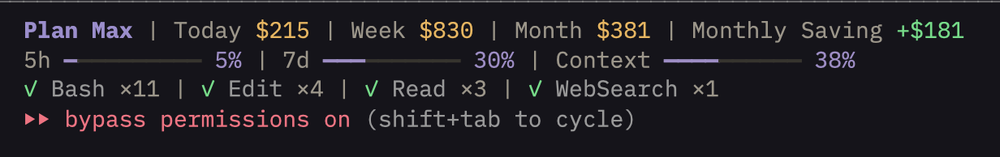
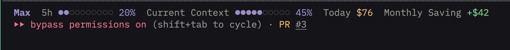

# Claude Office

A Claude Code statusline plugin that shows your plan quota, real-time costs, and how much you're saving compared to using the API directly.

[](LICENSE)
[](https://github.com/bpinheiroms/claude-office/stargazers)


## Full preset (expanded layout)



## Minimal preset (compact layout)



## Install

Inside a Claude Code session, run the following commands:

**Step 1: Add the marketplace**
```text
/plugin marketplace add bpinheiroms/claude-office
```

**Step 2: Install the plugin**
```text
/plugin install claude-office
```

**Step 3: Set up the statusline**
```text
/claude-office:setup
```

**Step 4: Customize (optional)**
```text
/claude-office:configure
```

Done! The statusline appears immediately — no restart needed.

---

## What is Claude Office?

Claude Office answers three questions you always have while using Claude Code:

| What You See | Why It Matters |
|--------------|----------------|
| **Plan quota** | Know when you're approaching your 5-hour rate limit before getting throttled |
| **Real costs** | See exactly how much you've spent today, this week, and this month in API-equivalent dollars |
| **Monthly Saving** | Understand how much you're saving by paying a flat subscription vs API pay-per-token pricing |
| **Context usage** | See how full your context window is before it gets auto-compressed |
| **Tool activity** | Watch Claude read, edit, and search files in real time |
| **Agent tracking** | See which sub-agents are running, their model, and elapsed time |
| **Todo progress** | Track task completion as Claude works through your checklist |

---

## What You See

### Compact layout (default)

```text
Plan Max | Today $51 | Monthly Saving +$16
5h ━━━━━━━━━━ 14%  Current Context ━━━━━━━━━━ 43%
```

Line 1 shows plan name and cost info (pipe-separated). Line 2 shows quota bars and context usage. Stays readable on narrow terminals.

### Expanded layout

```text
Plan Max | Today $51 | Week $665 | Month $216 | Monthly Saving +$16
5h ━━━━━━━━━━ 14%  7d ━━━━━━━━━━ 25%  Current Context ━━━━━━━━━━ 43%
```

Same two-line structure with all cost breakdowns and both quota bars enabled.

### Activity lines (optional, enable via config)

```text
◐ Read: .../file.ts | ✓ Edit ×10 | ✓ Bash ×3               ← Tools
◐ Explore [sonnet]: Exploring auth module (2m 15s)           ← Agents
▸ Implement login flow (3/7)                                 ← Todos
```

These appear only when there's activity to show.

### Color coding

| Color | Meaning |
|-------|---------|
| Purple | Normal quota and context usage |
| Yellow/Amber | Warning — quota/context above 75%, or cost values |
| Red | Critical — quota/context above 90%, at limit |
| Green | Positive monthly saving, completed items |

---

## How It Works

Claude Code invokes the statusline process every ~300ms, piping a JSON payload to stdin with model, context, and session info. The process collects data, renders ANSI output, and exits.

```text
Claude Code ──stdin JSON──▸ claude-office ──stdout──▸ terminal statusline
                                │
              ┌─────────────────┼─────────────────┐
              ▼                 ▼                  ▼
      Anthropic OAuth API   JSONL files     Transcript JSONL
      (quota, plan name)    (token costs)   (tools, agents, todos)
```

### Data sources

| Data | Source | Cache TTL |
|------|--------|-----------|
| Plan name, 5h/7d quota | Anthropic OAuth API (`/api/oauth/usage`) | 60s |
| Token costs (today/week/month) | `~/.claude/projects/` JSONL conversation files | 30s |
| Context usage | Claude Code stdin JSON (`context_window.used_percentage`) | Real-time |
| Tools, agents, todos | Session transcript JSONL (incremental) | 10s |

---

## Cost Calculation

Costs are calculated by scanning every JSONL conversation file in `~/.claude/projects/`. Each message in these files contains the model used and a token usage breakdown. Claude Office applies the correct API pricing for each model to each message individually.

### Per-model pricing

| Model | Input | Output | Cache Write | Cache Read |
|-------|-------|--------|-------------|------------|
| Opus 4.5 / 4.6 | $5 | $25 | $6.25 | $0.50 |
| Opus 4 / 4.1 | $15 | $75 | $18.75 | $1.50 |
| Sonnet 4 / 4.5 / 4.6 | $3 | $15 | $3.75 | $0.30 |
| Haiku 4.5 | $1 | $5 | $1.25 | $0.10 |
| Haiku 3.5 | $0.80 | $4 | $1.00 | $0.08 |

*Prices per 1M tokens. Source: [Anthropic pricing](https://www.anthropic.com/pricing).*

### What gets counted

Each API response in the JSONL files includes:

- **Input tokens** — your messages + system prompt sent to the model
- **Output tokens** — the model's response
- **Cache write tokens** — tokens written to prompt cache (first time a prefix is cached)
- **Cache read tokens** — tokens read from prompt cache (subsequent turns)

If a session uses Opus for planning and Sonnet for sub-agents, each message is priced at its own model's rate. Claude Office never averages or estimates — it reads the exact token counts and model ID from each message.

### Time windows

Costs are bucketed by each **message's individual timestamp**, not by file modification time. This means a conversation that started Monday but has messages today will correctly split costs across days.

| Period | Start | What it shows |
|--------|-------|---------------|
| **Today** | Midnight local time | Cost of messages sent today |
| **Week** | Friday 14:00 local time | Cost since last billing cycle reset (matches Anthropic's weekly rate limit window) |
| **Month** | 1st of the month, midnight | Total cost for the current calendar month |

---

## Monthly Saving Indicator

The **Monthly Saving** indicator shows how much you're saving by using a Claude subscription instead of paying API prices directly.

### How it's calculated

```text
Monthly Saving = Month API-equivalent cost − Plan price
```

Your month cost is the sum of all token costs at API rates. The plan price is your subscription:

| Plan | Monthly price |
|------|---------------|
| Max | $200 |
| Pro | $20 |
| Team | $30 |

### Examples

| Scenario | What you see | Explanation |
|----------|-------------|-------------|
| Used $520 of API tokens on Max plan | `Monthly Saving +$320` | You'd pay $520 on the API, but only pay $200/mo |
| Used $150 of API tokens on Max plan | *(hidden)* | Not showing negative — you haven't used $200 worth yet |
| Used $80 of API tokens on Pro plan | `Monthly Saving +$60` | $80 of tokens for $20/mo subscription |

Monthly Saving only appears when positive (you're getting more value than your subscription price).

---

## Token Refresh

When the Anthropic OAuth access token expires, Claude Office automatically refreshes it using the stored refresh token and updates the macOS Keychain. This happens transparently — no manual re-authentication needed.

The refresh flow uses Anthropic's OAuth token endpoint (`console.anthropic.com/v1/oauth/token`) with the PKCE flow credentials stored by Claude Code.

---

## Configuration

Customize what's displayed:

```text
/claude-office:configure
```

The guided flow walks you through:
- **First time**: Choose layout, pick a preset, toggle elements on/off, preview before saving
- **Returning user**: See current config, toggle elements, change layout, or reset to a preset

### Presets

| Preset | Layout | What's shown |
|--------|--------|-------------|
| **Full** | Expanded | Everything: all quotas, all costs, monthly saving, tools, agents, todos |
| **Minimal** | Compact | 5h quota, context, today cost, monthly saving |

### All options

| Option | Config key | Default (minimal) | Description |
|--------|------------|-------------------|-------------|
| Layout | `lineLayout` | `compact` | `expanded` (all data) or `compact` (condensed, 2 lines) |
| Plan name | *(always on)* | on | Shows Max, Pro, or Team |
| 5h quota bar | `showQuota5h` | on | 5-hour rate limit utilization |
| 7d quota bar | `showQuota7d` | off | 7-day rate limit utilization |
| Current Context bar | `showContext` | on | Context window usage percentage |
| Today cost | `showToday` | on | API-equivalent cost for today |
| Week cost | `showWeek` | off | Cost since Friday 14:00 (billing cycle) |
| Month cost | `showMonth` | off | Cost for the current calendar month |
| Monthly Saving | `showSaving` | on | How much you save vs API pricing |
| Tools | `showTools` | off | Live tool activity (Read, Edit, Bash, etc.) |
| Agents | `showAgents` | off | Sub-agent status with model and elapsed time |
| Todos | `showTodos` | off | Task progress tracking |

### Manual configuration

Edit `~/.claude/plugins/claude-office/config.json` directly:

```json
{
  "preset": "full",
  "display": {
    "lineLayout": "expanded",
    "showMonth": false,
    "showTools": true
  }
}
```

The `preset` sets the base, and `display` overrides individual settings. Only include overrides — values matching the preset default are unnecessary.

### Statusline setup (manual)

If you prefer not to use `/claude-office:setup`, add this to `~/.claude/settings.json`:

```json
{
  "statusLine": {
    "command": ["bun", "run", "/absolute/path/to/claude-office/src/statusline/index.ts"]
  }
}
```

---

## Technical Details

### Runtime

Claude Office runs exclusively on **Bun** — no Node.js runtime, no build step. TypeScript files execute directly via `bun run`. All file I/O uses native Bun APIs (`Bun.file()`, `Bun.write()`, `Bun.stdin`) for maximum performance.

### Architecture

The statusline is **stateless and single-shot**: each invocation reads stdin, checks caches, renders, writes stdout, and exits. No long-running process, no sockets, no daemon.

```text
stdin → [config + stdin] → [quota + usage + transcript] → render → stdout → exit
         parallel phase 1         parallel phase 2
```

Steps 1-2 run in parallel. Steps 3-5 run in parallel. Total: ~5ms cached, ~200ms uncached.

### Caching strategy

Every data source has its own persistent file-based cache at `~/.claude/plugins/claude-office/`:

| Cache file | TTL | Strategy |
|------------|-----|----------|
| `.quota-cache.json` | 60s | Store full API response; auto-refresh OAuth tokens on expiry |
| `.usage-cache.json` | 30s | Per-file mtime tracking + daily cost breakdown; only re-parse changed files |
| `.transcript-cache.json` | 10s | **Incremental byte reading**: cache file size, restore parsed state, read only new bytes appended since last parse |
| `config.json` | mtime | In-memory mtime check; re-parse only when file modification time changes |

#### Usage scanner

The usage scanner avoids re-parsing unchanged JSONL files by tracking each file's `mtimeMs`. On cache miss, it stores a **daily cost breakdown** per file (`{ "2026-03-02": 51.20, "2026-03-01": 14.80 }`), so time-window buckets (today/week/month) can be recomputed without re-parsing.

#### Transcript parser

The transcript parser uses **incremental reading**: it caches the file size and full parsed state (tool map, agent map, todos, task ID index). On the next invocation, if the file only grew (appended), it restores state from cache and only parses the new bytes from the cached offset. If the file was truncated or replaced, it falls back to a full parse.

### ANSI rendering

- **24-bit RGB colors** via `\x1b[38;2;r;g;bm` — no 256-color or 16-color fallback
- **Non-breaking spaces** (`\u00A0`) to prevent terminal whitespace collapsing
- **Semantic color palette**: separate colors for active/idle/done/urgent states, quota thresholds, cost tiers, and context health
- **Modular renderers**: tools, agents, and todos each have isolated render functions

### Performance budget

| Component | Cache hit | Cache miss |
|-----------|-----------|------------|
| Config | <1ms | <1ms |
| Stdin parse | <1ms | <1ms |
| Quota API | <1ms (file read) | 50-100ms (HTTP + token refresh) |
| Usage scanner | <1ms (file read) | 50-150ms (JSONL streaming) |
| Transcript | <2ms (restore + build) | 10-50ms (incremental parse) |
| Render | <1ms | <1ms |
| **Total** | **~5ms** | **~150-250ms** |

Budget: 300ms (Claude Code's maximum allowed statusline execution time).

---

## Project Structure

```text
src/
  statusline/               Statusline plugin (stateless, <300ms)
    index.ts                Entry: stdin -> collect -> render -> stdout
    stdin.ts                Parse Claude Code stdin JSON
    config.ts               Config loader with presets and layout modes
    usage-scanner.ts        Per-message cost aggregation (30s cache, mtime tracking)
    render.ts               Modular ANSI renderer (expanded/compact layout)
    transcript.ts           Incremental transcript parser (10s cache, byte-offset tracking)
  data/
    types.ts                Shared types (QuotaData)
    quota-api.ts            Anthropic OAuth API + automatic token refresh (60s cache)
.claude-plugin/
  plugin.json               Claude Code plugin metadata
  marketplace.json          Plugin marketplace listing
commands/
  setup.md                  /claude-office:setup — configure statusline
  configure.md              /claude-office:configure — customize display
```

---

## Requirements

- [Bun](https://bun.sh) v1.0+
- Claude Code v1.0.80+
- Claude Pro, Max, or Team subscription (for quota and saving data)

---

## Development

If you want to contribute or run from source:

```bash
git clone https://github.com/bpinheiroms/claude-office.git
cd claude-office
bun install
```

### Commands

```bash
# Run tests
bun test

# Type-check
bun run typecheck

# Test statusline (empty stdin)
echo '{}' | bun run src/statusline/index.ts

# Test with simulated context data
echo '{"context_window":{"used_percentage":45,"context_window_size":200000}}' | bun run src/statusline/index.ts

# Benchmark (should be <300ms)
time (echo '{}' | bun run src/statusline/index.ts > /dev/null)
```

---

## Contributing

See [CONTRIBUTING.md](CONTRIBUTING.md) for setup, code style, and PR guidelines.

1. Fork the repo and create a branch from `main`
2. Make your changes
3. Run `bun run typecheck` — must pass with no errors
4. Test: `echo '{}' | bun run src/statusline/index.ts`
5. Open a pull request

---

## License

[MIT](LICENSE)
